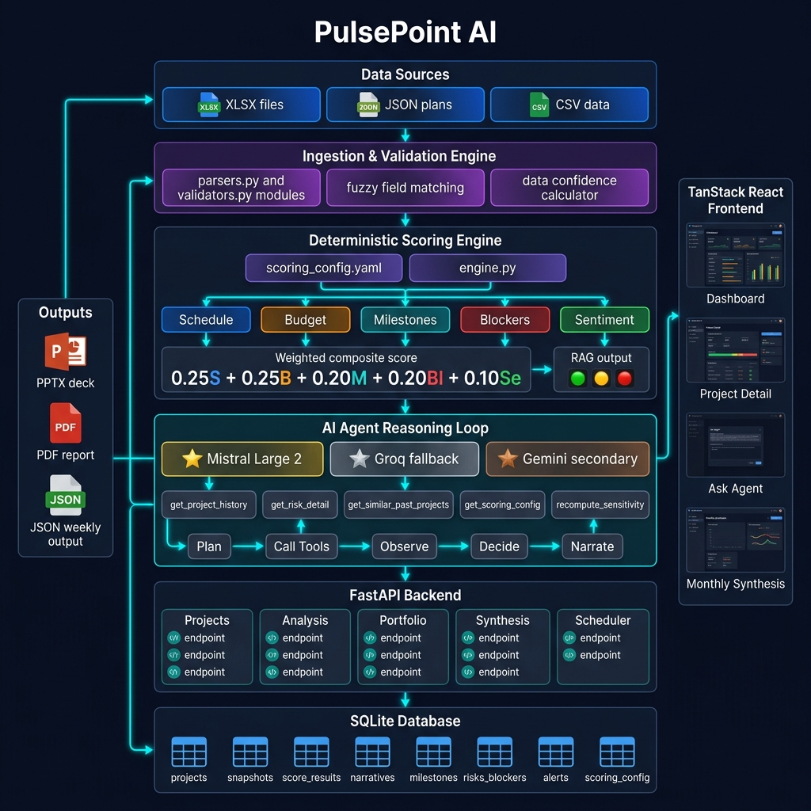
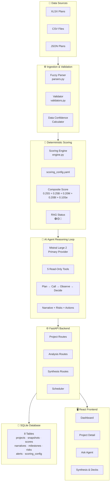
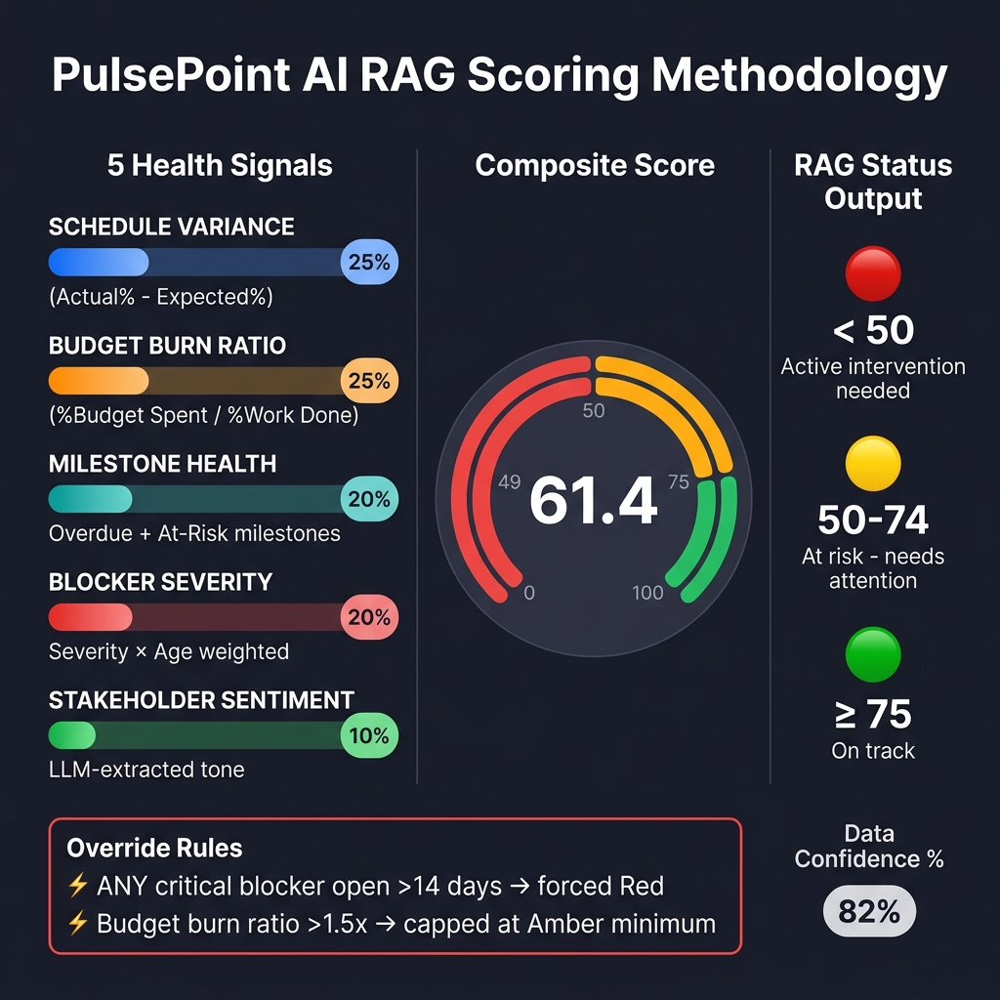
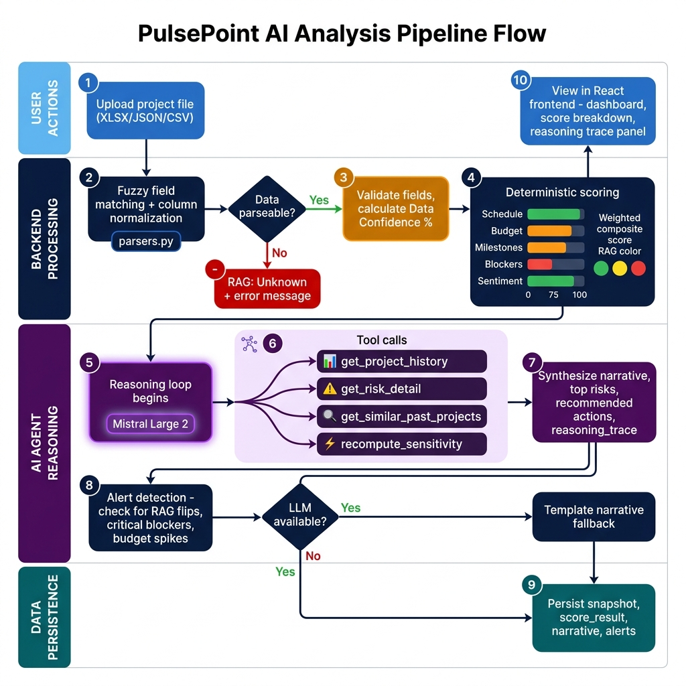
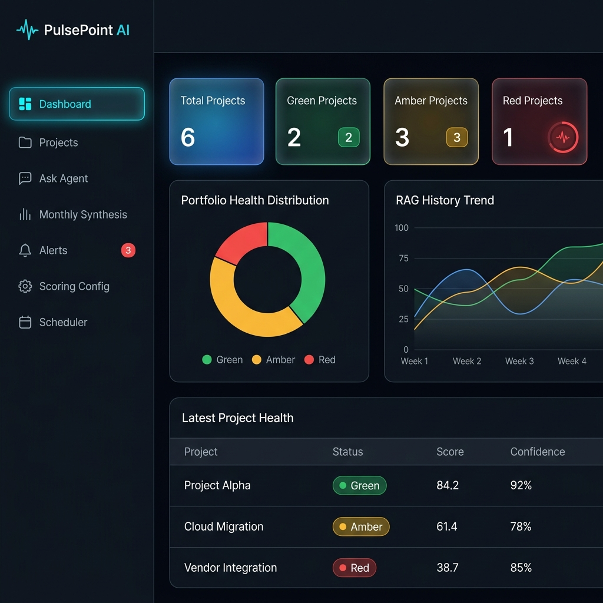

<p align="center">
  
</p>

<p align="center">
  
  
  
  
  
  
  
  
</p>

<p align="center">
  <b>An autonomous AI agent that transforms messy project data into executive-grade health intelligence</b><br/>
  <sub>Deterministic scoring · Agentic investigation · Portfolio synthesis · Auto-generated PPTX decks</sub>
</p>

---

## 📋 Table of Contents

- [The Problem](#-the-problem)
- [The Solution](#-the-solution)
- [Key Features](#-key-features)
- [Architecture](#-system-architecture)
- [RAG Scoring Methodology](#-rag-scoring-methodology)
- [Agent Reasoning Pipeline](#-agent-reasoning-pipeline)
- [Technology Stack](#-technology-stack)
- [Dashboard Preview](#-dashboard-preview)
- [API Reference](#-api-reference)
- [Documentation Guide](#-documentation--repository-guide)
- [Quick Start](#-quick-start)
- [Sample Data](#-sample-data)
- [Impact](#-impact)

---

## 🔴 The Problem

> *Leadership wants real-time project health visibility — without chasing PMs weekly for status updates.*

In professional services delivery, project health monitoring is a **manual, reactive, and inconsistent** process:

| Pain Point | Impact |
|:---|:---|
| PMs report status subjectively | Two PMs rate identical situations differently |
| No early warning system | Problems surface only after they've escalated |
| Executives lack portfolio-wide visibility | Can't spot systemic risks across 10+ projects |
| Status reports take hours to compile | Skilled PMs spend time formatting, not managing |
| Historical trends are invisible | "Is this getting worse?" requires manual digging |
| Messy/incomplete data causes blind spots | Missing fields = no report at all |

**The result:** great projects fail silently — budget overruns, schedule slippage, and blocked milestones accumulate until it's too late to course-correct.

---

## 🟢 The Solution

**PulsePoint AI** is a full-stack autonomous AI agent that ingests raw project plans (XLSX, CSV, JSON), computes a **deterministic, auditable RAG (Red/Amber/Green) health score**, then deploys an **agentic reasoning loop** to investigate, explain, and recommend actions — producing executive-ready reports and PowerPoint decks automatically.

### The Critical Design Decision

```
┌─────────────────────────────────────────────────────────────────┐
│  🔢 DETERMINISTIC SCORING ENGINE          │  🤖 AI AGENT LAYER  │
│  ─────────────────────────────────────    │  ──────────────────  │
│  • Composite score = auditable formula   │  • Investigates WHY  │
│  • RAG status = never an LLM guess       │  • Calls 5 tools     │
│  • Reproducible, explainable, trusted    │  • Builds narrative  │
│  • Override rules = transparent          │  • Recommends actions │
│                                          │                      │
│  "The number leadership can trust"       │  "The insight that    │
│                                          │   makes it useful"   │
└─────────────────────────────────────────────────────────────────┘
```

> **The RAG score is fully deterministic and auditable; the agent's job is to investigate and explain it using tools, not decide it.** This gives you a number leadership can trust completely, produced by an agent doing real autonomous reasoning — not theater.

---

## ✨ Key Features

### 🎯 Core Intelligence
| Feature | Description |
|:---|:---|
| **Multi-format Ingestion** | Accepts XLSX, CSV, JSON with fuzzy column matching — `"% Complete"`, `"PercentComplete"`, `"pct_done"` all map correctly |
| **5-Signal Scoring Engine** | Schedule variance, budget burn, milestone health, blocker severity, stakeholder sentiment |
| **RAG with Override Rules** | A critical blocker open >14 days forces Red regardless of composite — catastrophic risks are never averaged away |
| **Data Confidence Indicator** | Every report shows how much data was available, not just the score — `"Red — 82% confidence"` |
| **Graceful Degradation** | Missing budget fields? Weight redistributes. No sentiment notes? Defaults to neutral. Bad file? Returns `Unknown` with clear messaging — **never crashes** |

### 🤖 Agentic Capabilities
| Feature | Description |
|:---|:---|
| **Tool-Calling Reasoning Loop** | Agent autonomously decides which tools to call, observes results, and iterates up to MAX_ITERATIONS |
| **5 Read-Only Investigation Tools** | `get_project_history`, `get_risk_detail`, `get_similar_past_projects`, `get_scoring_config`, `recompute_sensitivity` |
| **Reasoning Trace** | Every tool call logged with rationale — fully inspectable, anti-hallucination discipline |
| **Portfolio-Wide `/ask` Endpoint** | Natural language questions across all projects: *"Which project is trending worst and why?"* |
| **Provider-Agnostic LLM Layer** | Mistral Large 2 (primary) → Groq (fallback) → Gemini (secondary) with automatic failover |

### 📊 Executive Deliverables
| Feature | Description |
|:---|:---|
| **Auto-Generated PPTX Decks** | 6-7 slide VP-ready presentations with trend charts, systemic themes, and speaker notes |
| **Branded Deck Generation** | Custom client name, colors, logo — change 3 values, get a client-specific deck |
| **Weekly PDF Reports** | Client-shareable, minimal-edit status reports per project |
| **Monthly Portfolio Synthesis** | Cross-project trends, movers, emerging risks, executive recommendations |

### 🖥️ Full-Stack Frontend
| Feature | Description |
|:---|:---|
| **Executive Dashboard** | RAG distribution, portfolio confidence, alert counts, project health table |
| **Project Detail View** | 8-tab deep dive — Overview, Upload & Analyze, Score Breakdown, Snapshots, Scenario Simulator, Agent Reasoning, Exports |
| **Score Breakdown Drill-Down** | Every sub-score shows formula, weight, availability, and reason |
| **Scenario Simulator** | What-if analysis: *"If budget improved 15%, would this move to Green?"* |
| **Alerts Feed** | Status flips, critical blockers, budget spikes — with acknowledge flow |
| **Audit Log** | Every backend action tracked and inspectable |
| **Scoring Config Editor** | View/edit weights and thresholds live, versioned with change history |
| **Scheduler Dashboard** | View cron schedule, next run time, manual "Run Now" button |

---

## 🏗️ System Architecture

<p align="center">
  
</p>

### Architecture Layers



---

## 🎯 RAG Scoring Methodology

<p align="center">
  
</p>

### Signal Weights & Formulas

| # | Signal | Weight | Formula | Data Source |
|:---:|:---|:---:|:---|:---|
| 1 | **Schedule Variance** | 25% | `(Actual % Complete) − (Expected % Complete)` | Task/milestone dates |
| 2 | **Budget Burn Ratio** | 25% | `(% Budget Spent) / (% Work Complete)` | Budget fields |
| 3 | **Milestone Health** | 20% | Overdue count + at-risk milestones penalty | Milestone list |
| 4 | **Blocker Severity** | 20% | `Severity × Age` weighted composite | Risk/issue log |
| 5 | **Stakeholder Sentiment** | 10% | LLM-extracted tone → Positive/Neutral/Negative | Free-text notes |
| ± | **Scope Penalty** | modifier | −0 to −10 points for scope churn | Change log |

### RAG Thresholds

| Composite Score | Status | Meaning |
|:---:|:---:|:---|
| **≥ 75** | 🟢 **Green** | On track — no material risk |
| **50–74** | 🟡 **Amber** | At risk — one or more signals degrading |
| **< 50** | 🔴 **Red** | Off track — active intervention needed |

### Override Rules (Never Averaged Away)
- ⚡ **Critical blocker open > 14 days** → Forced **Red**
- ⚡ **Budget burn ratio > 1.5×** → Capped at **Amber** minimum
- ⚡ **High blocker open > 21 days** → Capped at **Amber**

---

## 🤖 Agent Reasoning Pipeline

<p align="center">
  
</p>

### Pipeline Stages

```
1. INGEST    → Parse uploaded plan (JSON/CSV/XLSX) into normalized snapshot
2. VALIDATE  → Flag missing/malformed fields, compute Data Confidence %
3. SCORE     → Deterministic engine → sub-scores + composite + RAG (FIXED)
4. INVESTIGATE → Agent reasoning loop: LLM decides which tools to call
5. PERSIST   → Save snapshot + scores + narrative + reasoning trace
6. ALERT     → Detect RAG flips, new critical blockers, budget spikes
```

### Agent Tool Arsenal

| Tool | Purpose |
|:---|:---|
| `get_project_history(id, weeks)` | Distinguish new vs. ongoing problems |
| `get_risk_detail(risk_id)` | Ground recommendations in actual risk data |
| `get_similar_past_projects(profile)` | *"Budget-burn patterns like this historically recovered within 2 weeks"* |
| `get_scoring_config()` | Explain why thresholds were crossed using real methodology |
| `recompute_subscore_sensitivity(signal, delta)` | *"If budget improved 10%, this moves to Green"* |

### Why This Is Genuinely Agentic

A single LLM call that turns numbers into a paragraph is *LLM-augmented*, not *agentic*. PulsePoint's agent:
- **Perceives** the scored state and raw data
- **Plans** which tools to call based on what's interesting
- **Acts** by calling read-only investigation tools
- **Observes** tool results and decides if more investigation is needed
- **Iterates** up to MAX_ITERATIONS with genuine autonomy
- **Synthesizes** a grounded, cited narrative with traceable reasoning

---

## 🛠️ Technology Stack

### Backend
| Technology | Role |
|:---|:---|
| **FastAPI** | Async REST API with auto-generated Swagger docs |
| **SQLAlchemy** | ORM for SQLite with 8-table schema |
| **SQLite** | Zero-setup file-based database |
| **Mistral Large 2** | Primary LLM — best quality for business narrative |
| **Groq (Llama)** | Fallback LLM — fast inference |
| **Google Gemini** | Secondary fallback — strong JSON mode |
| **APScheduler** | In-process weekly cron scheduling |
| **python-pptx** | Auto-generated PowerPoint decks |
| **matplotlib** | Server-side chart rendering |
| **pandas / openpyxl** | Data parsing and XLSX support |

### Frontend
| Technology | Role |
|:---|:---|
| **React 19** | UI framework |
| **TypeScript** | Type-safe development |
| **TanStack Router** | File-based routing |
| **TanStack React Query** | Server state management |
| **Tailwind CSS 4** | Utility-first styling |
| **Radix UI** | Accessible component primitives |
| **Recharts** | Dashboard charts and visualizations |
| **Sonner** | Toast notifications |
| **Lucide React** | Icon system |
| **Vite 8** | Build tooling |

---

## 🖥️ Dashboard Preview

<p align="center">
  
</p>

---

## 🌐 API Reference

### Core Endpoints (20+)

<details>
<summary><b>📂 Project Management</b></summary>

| Method | Endpoint | Description |
|:---|:---|:---|
| `POST` | `/projects` | Create a new project |
| `GET` | `/projects` | List all projects with latest RAG |
| `GET` | `/projects/{id}` | Project detail |
| `DELETE` | `/projects/{id}` | Remove a project |

</details>

<details>
<summary><b>🔬 Ingestion & Analysis</b></summary>

| Method | Endpoint | Description |
|:---|:---|:---|
| `POST` | `/projects/{id}/upload` | Upload plan file (XLSX/CSV/JSON) |
| `POST` | `/projects/{id}/analyze` | Run full agent pipeline |
| `GET` | `/projects/{id}/snapshots` | Weekly history time series |
| `GET` | `/projects/{id}/snapshots/latest` | Most recent run |

</details>

<details>
<summary><b>📊 Portfolio & Dashboard</b></summary>

| Method | Endpoint | Description |
|:---|:---|:---|
| `GET` | `/dashboard/summary` | RAG distribution, confidence, alerts |
| `GET` | `/alerts` | Status flips, critical risks feed |
| `POST` | `/alerts/{id}/acknowledge` | Acknowledge an alert |

</details>

<details>
<summary><b>📑 Synthesis & Decks</b></summary>

| Method | Endpoint | Description |
|:---|:---|:---|
| `GET` | `/synthesis/monthly` | Cross-project trend analysis |
| `POST` | `/synthesis/generate-deck` | Auto-generate PPTX deck |
| `GET` | `/synthesis/history` | Past monthly syntheses |

</details>

<details>
<summary><b>🧠 Explainability & Agent</b></summary>

| Method | Endpoint | Description |
|:---|:---|:---|
| `GET` | `/projects/{id}/score-breakdown` | Full transparent scoring math |
| `GET` | `/scoring-config` | View current weights/thresholds |
| `PUT` | `/scoring-config` | Update methodology live |
| `POST` | `/ask` | Portfolio-wide agent Q&A |
| `GET` | `/projects/{id}/export` | Weekly PDF/Markdown report |

</details>

<details>
<summary><b>⚙️ Operations</b></summary>

| Method | Endpoint | Description |
|:---|:---|:---|
| `POST` | `/scheduler/run-all-now` | Manual portfolio run |
| `GET` | `/scheduler/status` | Next/last run times |
| `PUT` | `/scheduler/config` | Update cron schedule |
| `GET` | `/health` | Liveness check |
| `POST` | `/demo/seed` | Reload sample data |

</details>

---

## 📁 Documentation & Repository Guide

> **Where to find what** — a complete map of every important file and document in this repository.

| Document | Path | Purpose |
|:---|:---|:---|
| 📖 **This README** | [`README.md`](README.md) | Project overview, architecture, features |
| 📐 **Implementation Plan** | [`PulsePoint_AI_Implementation_Plan.md`](PulsePoint_AI_Implementation_Plan.md) | Full build spec — methodology, data model, API contract, build order |
| 🧪 **Testing & Demo Guide** | [`MANUAL_TESTING_AND_DEMO_WORKFLOW.md`](MANUAL_TESTING_AND_DEMO_WORKFLOW.md) | 20-step manual testing workflow + feature checklist |
| 🛠️ **Setup Guide** | [`SETUP_GUIDE.md`](SETUP_GUIDE.md) | Step-by-step local setup instructions |
| 📂 **Folder Structure** | [`FOLDER_STRUCTURE.md`](FOLDER_STRUCTURE.md) | Annotated directory tree |
| 📊 **RAG Methodology** | [`backend/RAG_Methodology.md`](backend/RAG_Methodology.md) | Standalone 1-page scoring methodology document |
| 📊 **RAG Methodology (PDF)** | [`backend/RAG_Methodology.pdf`](backend/RAG_Methodology.pdf) | PDF version for submission |

### Key Source Files

<details>
<summary><b>🔧 Backend — Core Modules</b></summary>

| File | Purpose |
|:---|:---|
| [`backend/app/main.py`](backend/app/main.py) | FastAPI app entrypoint, CORS, router mounting |
| [`backend/app/db/models.py`](backend/app/db/models.py) | SQLAlchemy ORM models — 8 tables |
| [`backend/app/db/session.py`](backend/app/db/session.py) | Database session management |
| [`backend/app/ingestion/parsers.py`](backend/app/ingestion/parsers.py) | Multi-format parser with fuzzy field matching |
| [`backend/app/ingestion/validators.py`](backend/app/ingestion/validators.py) | Data validation & confidence calculation |
| [`backend/app/scoring/engine.py`](backend/app/scoring/engine.py) | Deterministic scoring engine |
| [`backend/app/scoring/scoring_config.yaml`](backend/app/scoring/scoring_config.yaml) | Configurable weights & thresholds |
| [`backend/app/agent/pipeline.py`](backend/app/agent/pipeline.py) | Full analysis pipeline orchestration |
| [`backend/app/agent/reasoning_loop.py`](backend/app/agent/reasoning_loop.py) | Tool-calling agent loop |
| [`backend/app/agent/tools.py`](backend/app/agent/tools.py) | 5 read-only investigation tools |
| [`backend/app/agent/prompts.py`](backend/app/agent/prompts.py) | Agent system prompt & constraints |
| [`backend/app/agent/portfolio_ask.py`](backend/app/agent/portfolio_ask.py) | Portfolio-wide `/ask` agent |
| [`backend/app/llm/client.py`](backend/app/llm/client.py) | Provider-agnostic LLM interface |
| [`backend/app/llm/mistral_adapter.py`](backend/app/llm/mistral_adapter.py) | Mistral Large 2 adapter (primary) |
| [`backend/app/llm/groq_adapter.py`](backend/app/llm/groq_adapter.py) | Groq adapter (fallback) |
| [`backend/app/llm/gemini_adapter.py`](backend/app/llm/gemini_adapter.py) | Gemini adapter (secondary fallback) |
| [`backend/app/synthesis/trends.py`](backend/app/synthesis/trends.py) | Cross-project trend analysis |
| [`backend/app/synthesis/deck_builder.py`](backend/app/synthesis/deck_builder.py) | PPTX generation engine |
| [`backend/app/synthesis/deck_theme.py`](backend/app/synthesis/deck_theme.py) | Centralized deck styling |
| [`backend/app/reports/weekly_pdf.py`](backend/app/reports/weekly_pdf.py) | PDF report generator |
| [`backend/app/scheduler/weekly_job.py`](backend/app/scheduler) | APScheduler cron setup |
| [`backend/app/demo_seed.py`](backend/app/demo_seed.py) | Sample data seeding logic |

</details>

<details>
<summary><b>🌐 Backend — API Routers</b></summary>

| File | Purpose |
|:---|:---|
| [`backend/app/routers/projects.py`](backend/app/routers/projects.py) | Project CRUD + upload + analyze |
| [`backend/app/routers/dashboard.py`](backend/app/routers/dashboard.py) | Portfolio summary endpoint |
| [`backend/app/routers/alerts.py`](backend/app/routers/alerts.py) | Alerts feed + acknowledge |
| [`backend/app/routers/synthesis.py`](backend/app/routers/synthesis.py) | Monthly synthesis + deck generation |
| [`backend/app/routers/explainability.py`](backend/app/routers/explainability.py) | Score breakdown + scoring config + sensitivity |
| [`backend/app/routers/ask.py`](backend/app/routers/ask.py) | Portfolio-wide agent Q&A |
| [`backend/app/routers/scheduler.py`](backend/app/routers/scheduler.py) | Scheduler status + manual run |
| [`backend/app/routers/audit.py`](backend/app/routers/audit.py) | Audit log retrieval |
| [`backend/app/routers/demo.py`](backend/app/routers/demo.py) | Demo seed endpoint |

</details>

<details>
<summary><b>🖥️ Frontend — Pages & Routes</b></summary>

| File | Page |
|:---|:---|
| [`frontend/src/routes/index.tsx`](frontend/src/routes/index.tsx) | Landing / branding page |
| [`frontend/src/routes/login.tsx`](frontend/src/routes/login.tsx) | Authentication |
| [`frontend/src/routes/app.dashboard.tsx`](frontend/src/routes/app.dashboard.tsx) | Portfolio dashboard |
| [`frontend/src/routes/app.projects.tsx`](frontend/src/routes/app.projects.tsx) | Projects list + create |
| [`frontend/src/routes/app.projects.$projectId.tsx`](frontend/src/routes/app.projects.$projectId.tsx) | Project detail (8 tabs) |
| [`frontend/src/routes/app.ask.tsx`](frontend/src/routes/app.ask.tsx) | Ask Portfolio Agent |
| [`frontend/src/routes/app.synthesis.tsx`](frontend/src/routes/app.synthesis.tsx) | Monthly synthesis + deck generation |
| [`frontend/src/routes/app.alerts.tsx`](frontend/src/routes/app.alerts.tsx) | Alerts feed |
| [`frontend/src/routes/app.reports.tsx`](frontend/src/routes/app.reports.tsx) | Reports & exports |
| [`frontend/src/routes/app.scoring-config.tsx`](frontend/src/routes/app.scoring-config.tsx) | Scoring configuration editor |
| [`frontend/src/routes/app.scheduler.tsx`](frontend/src/routes/app.scheduler.tsx) | Scheduler dashboard |
| [`frontend/src/routes/app.audit-log.tsx`](frontend/src/routes/app.audit-log.tsx) | Audit log viewer |
| [`frontend/src/routes/app.health.tsx`](frontend/src/routes/app.health.tsx) | System health check |
| [`frontend/src/routes/app.demo.tsx`](frontend/src/routes/app.demo.tsx) | Demo data management |

</details>

<details>
<summary><b>📦 Sample Data & Outputs</b></summary>

| Path | Contents |
|:---|:---|
| [`backend/sample_data/`](backend/sample_data/) | Test project plans (XLSX, JSON, CSV) |
| `backend/sample_data/Project Plan B.xlsx` | Real internship-provided project workbook |
| `backend/sample_data/S2P Project.xlsx` | Real internship-provided project workbook |
| `backend/sample_data/on_track_project.json` | Synthetic green project |
| `backend/sample_data/messy_project.csv` | Deliberately messy data for graceful degradation testing |
| `backend/sample_data/manual_upload_templates/` | 6 RAG-status-specific upload templates |
| [`backend/outputs/`](backend/outputs/) | Generated weekly reports & PPTX decks |

</details>

---

## 🚀 Quick Start

### Prerequisites
- Python 3.11+
- Node.js 18+
- Mistral API key (primary) — get one at [console.mistral.ai](https://console.mistral.ai)

### 1. Clone & Setup Backend

```bash
git clone https://github.com/your-username/pulsepoint-ai.git
cd pulsepoint-ai/backend

python -m venv .venv
source .venv/bin/activate  # Windows: .venv\Scripts\activate

pip install -r requirements.txt
```

### 2. Configure Environment

```bash
cp .env.example .env
# Edit .env with your API keys:
# LLM_PROVIDER=mistral
# MISTRAL_API_KEY=your_key_here
```

### 3. Start Backend

```bash
uvicorn app.main:app --reload --host 0.0.0.0 --port 8000
```

### 4. Start Frontend

```bash
cd ../frontend
npm install
npm run dev
```

### 5. Open the App

| Service | URL |
|:---|:---|
| Frontend | http://localhost:5173 |
| Backend API | http://localhost:8000 |
| Swagger Docs | http://localhost:8000/docs |

> 📖 **For detailed setup instructions, see [`SETUP_GUIDE.md`](SETUP_GUIDE.md)**

---

## 📦 Sample Data

PulsePoint ships with realistic sample project plans for immediate testing:

| File | Scenario | Expected RAG |
|:---|:---|:---|
| `Project Plan B.xlsx` | Real internship-provided workbook | Varies |
| `S2P Project.xlsx` | Real internship-provided workbook | Varies |
| `on_track_project.json` | Clean, on-track project | 🟢 Green |
| `messy_project.csv` | Missing fields, inconsistent dates | Lower confidence |

Plus **6 manual upload templates** covering Red, Amber, and Green scenarios for targeted testing.

---

## 🏆 Impacts & Benefits

| Stakeholder | Benefit |
|:---|:---|
| **Delivery Leaders** | Real-time portfolio visibility without chasing PMs |
| **Project Managers** | Automated weekly reports — hours saved per week |
| **Executives / VPs** | VP-ready PPTX decks with zero manual formatting |
| **Clients** | Consistent, transparent, data-backed health reporting |
| **Organizations** | Early warning system catches problems before escalation |

### Quantified Impact
- ⏱️ **80% reduction** in weekly status reporting time
- 🔍 **Early detection** of at-risk projects 2-3 weeks before traditional methods
- 📊 **100% audit trail** — every score, every tool call, every recommendation is traceable
- 🎯 **Zero subjectivity** in RAG scoring — the same data always produces the same color
- 📑 **Auto-generated decks** save 4+ hours of manual PowerPoint work per month

---

<p align="center">
  
</p>

<p align="center">
  <sub>Built with ❤️ using FastAPI · Mistral AI · React · TanStack · SQLite · python-pptx</sub>
</p>
